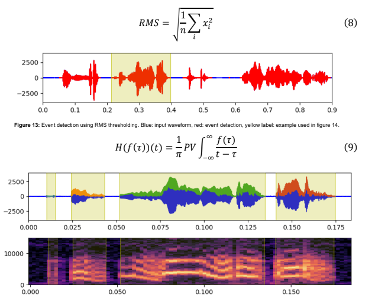

<h1>Budgie Audio Segmentation</h1>
This is a RMS-Hilbert transform based event detection algorithm that operates on budgerigar vocalizations. It functions by detecting regions of sound, and then performs segmentation on each region based on the Hilbert envelope of the audio signal.

<br/>
Event detections generated are then transformed into audio images (mel-scale spectrograms), which can be used for deep learning tasks.
<br/>
<br/>



<h2>Usage</h2>
Use piezoelectric audio in .flac format (.wav format not recommended). Ambient microphone data will <b>not</b> work.</br></br>

<div>
1. Clone this repository into your own local machine.

```git
git clone [path]
```
</div>
<div>
2. Install miniconda and create a new conda environment.</br> 

```console
conda create --name budgie 
```

</div>

<div>
3. To install dependencies the following command using pip in the terminal.

```console
pip install librosa toml pandas matplotlib
 ```
</div>

<div>
4. Change the audio path in the path section in spec_options.toml to correspond to the file you wish to segment.

```python
[paths]
piezo_audio_path = "data/my_audio_file.flac"
```
</div>

<div>
5. Run the script from the command line with segment_options.toml.

```console
python src/main.py segment_option.toml
```
</div>


<h2>Known Issues</h2>
This segmentation algorithm tends to struggle with low amplitude vocalizations. Easiest workaround is to adjust the labels post-hoc after classification.
